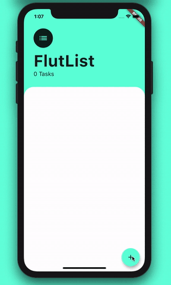

# FlutList

A simple To-Do List application made with [Flutter](https://flutter.dev/) Framework.

## Screenshot

## About

The app was made mainly to challenge myself working with Flutter, and I did start it specially to get used to the use of [Provider Package](https://pub.dev/packages/provider). I am currently working on a complex budgeting app which needs some optimisation (State Management), this small app helped me understand the concept and now I am implementing the Provider Package to my Budgeting app.

## Technologies

* Flutter Framework (Dart programming language)
* Provider Package

## Functionality

* Addind task by pressing the + bottom button
* Removing task by hold pressing it in the list

## Note

The app was made in few hours during 2-3 days.
